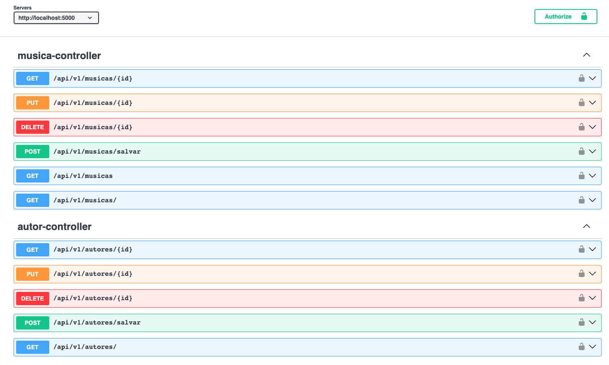

# API Spring Boot para Músicas e Autores

Bem-vindo à API Spring Boot para Músicas e Autores. Esta API fornece acesso a recursos relacionados a músicas e autores. Ela é protegida por uma chave de API para fins de autenticação.



## Descrição Geral

- **Tecnologia**: Spring Boot
- **Banco de Dados**: H2DB (para dados em memória)
- **Estratégia HATEOAS**: Spring HATEOAS

## Funcionalidades Principais

- Recursos para músicas e autores.
- Filtros de dados para pesquisar músicas e autores com base em critérios específicos.
- Paginação para lidar com grandes conjuntos de dados, permitindo a navegação pelas páginas de resultados.
- Ordenação (sort) de dados para organizar os resultados de acordo com critérios escolhidos.
- Autenticação via chave de API para proteger o acesso à API.
- Formato de dados JSON para todas as solicitações e respostas.
- Versionamento semântico da API via URL para garantir a compatibilidade com versões futuras.
- Documentação completa na [Swagger UI](http://localhost:5005/swagger-ui/index.html/), incluindo exemplos de solicitações e respostas.

## Documentação da API

A documentação da API pode ser acessada em [Swagger UI](http://localhost:5005/swagger-ui/index.html/). Lá, você encontrará detalhes sobre os endpoints, parâmetros, respostas e como usar a API.

Para acessar o arquivo specification da API em [OpenAPISpecification](api-specification-doc.yaml)

## Como Executar

Para executar a aplicação Spring Boot, siga estas etapas:

1. Certifique-se de ter o Java instalado na sua máquina.
2. Clone este repositório para o seu ambiente local.
3. Abra um terminal na pasta raiz do projeto.
4. Execute o seguinte comando:

```shell
./mvnw spring-boot:run


